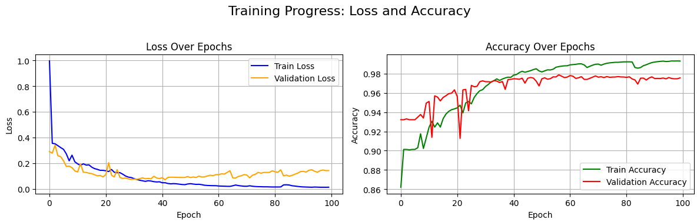
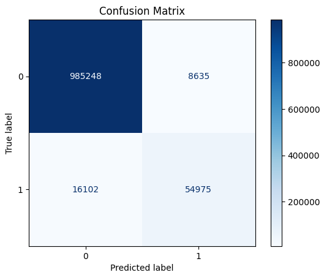
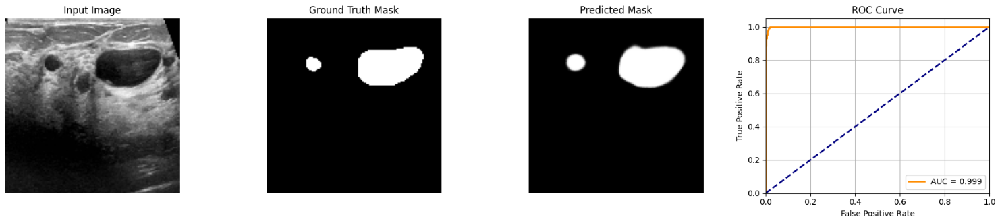

# Breast Ultrasound Image Segmentation using U-Net

This project applies a U-Net convolutional neural network to perform **biomedical image segmentation** on breast ultrasound images, helping in early breast cancer detection.

---

## 🛠️ Project Structure

- **Model**: U-Net architecture customized for grayscale ultrasound images.
- **Dataset**: Breast ultrasound images (grayscale) with ground truth masks.
- **Goal**: Segment lesions or regions of interest (ROI) from ultrasound scans.

---

## 🔗 Model Weights

You can download the pre-trained model weights from Google Drive:

[📥 Download model.weights.h5](https://drive.google.com/uc?id=1kwNT9dJ48L2VZn19GeqD5i4it2k06d8Q&export=download)

After downloading, place it in the root project directory before running `Testing_Unet.ipynb`.

## 📈 Training Progress

Training was conducted over **100 epochs**, with the following trends:



- **Train Loss** consistently decreased.
- **Validation Loss** stabilized with minor fluctuations.
- **Train Accuracy** steadily improved, reaching high 90%+.
- **Validation Accuracy** closely follows training, suggesting low overfitting.

---

## 🎯 Evaluation Metrics

After training, the model's performance on the test dataset was:

| Metric      | Score |
|-------------|-------|
| Mean IoU    | 0.833 |
| Precision   | 0.871 |
| Recall      | 0.767 |
| F1 Score    | 0.815 |

These results indicate the model segments the breast lesions **with high precision and good overlap** with the ground truth.

---

## 📊 Confusion Matrix



- High number of true negatives and true positives.
- Small amount of false positives and false negatives.

---

## 📋 Testing Examples

### Example 1: Input Image vs Ground Truth vs Prediction



- **Left**: Input ultrasound image.
- **Middle**: Ground Truth mask.
- **Right**: Model's Predicted mask.
- The predicted segmentation closely matches the actual tumor region.

### ROC Curve

- The **AUC (Area Under Curve)** is **0.999**, indicating almost perfect classification capability.

---

## 🧪 Testing Notebook (testing.ipynb)

The testing notebook covers:

1. Loading the trained weights.
2. Visualizing random predictions (input, mask, predicted mask).
3. Plotting ROC curve.
4. Generating Confusion Matrix.
5. Computing Evaluation Metrics (IoU, Precision, Recall, F1 Score).

---

## 🚀 How to Run

1. Clone this repository.
2. Install requirements:
   ```bash
   pip install -r requirements.txt
